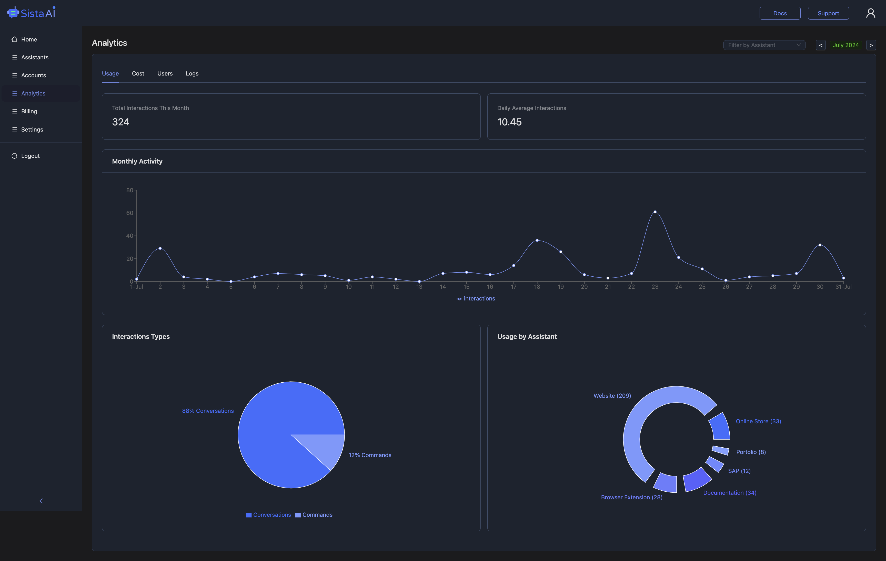

import SupportedSDKs from '@site/src/components/SupportedSDKs';

# Welcome to Sista AI

This guide will introduce you to the essential features and setup steps to integrate Sista AI into your applications quickly.

Give your App a voice, with a conversational AI assistant and interactive voice UI **in less than 10 minutes**!

**No Code Changes! No Intent Definitions!** _Just add our magic button `<AiAssistantButton />`._

## What is Sista AI?

Sista AI is an end-to-end AI integration platform that enables you to add conversational AI, voice UI, and UI control to your Apps and websites quickly and easily, without any code changes!

## Why Sista AI?

Sista AI is the most advanced AI assistant on the market and the easiest to integrate, designed by developers for developers. 

Its context-aware models intelligently answer user questions, enhancing engagement. By allowing full control of the UI through voice commands, it improves accessibility and user experience.

## Features at a Glance

- **AI Assistant:** Answers any question
- **UI Controller:** Performs any action
- **Voice UI:** Speaks any language
- **Auto Scraper:** Scrape any page
- **Admin Panel:** Customizes any detail

## Demo

Click the round button located at the bottom right corner 👉

## Quick Start

Get up and running with Sista AI in less than 10 minutes! Our platform is designed to be plug-and-play with minimal configuration required. Here's what you'll learn in this documentation:

> - **How to Install the AI Assistant:** Follow simple steps to integrate Sista AI quickly into your application.
> - **How to Customize the Assistant Button:** Place the magic button in your app for easy user interaction.
> - **How to Update the UI Dynamically:** Implement methods to refresh your application’s interface in response to user interactions.

## Plug & Play AI Integration

Integrating AI into your applications is now simpler than ever. The [Admin Panel](https://admin.sista.ai/applications) offers full control, customization, powerful analytics, and detailed insights to optimize user experiences.

|  |
| :---------------------------------------------------------: |
|                   _Sista AI Admin Panel_                    |

## Supported Platforms

Our AI technology is supported across all platforms, delivering a unified experience for users everywhere.

<SupportedSDKs/>

## Real-World Implementations:

Here are some open-source, real-world implementations:

- **Sista AI Docs**: [Live Demo](https://docs.sista.ai/) - [Source Code](https://github.com/sista-ai/docs/blob/main/src/components/AiAssistant/index.tsx).
- **Porto SAP**: [Live Demo](https://mahmoudz.github.io/Porto/) - [Source Code](https://github.com/Mahmoudz/Porto/blob/master/docs/src/components/AiAssistant/index.tsx).

## Contributing

Your contributions are warmly welcomed! Let's collaborate 🤝

## License

Licensed under [CC BY-NC-ND 3.0](https://github.com/sista-ai/ai-assistant-react/blob/main/LICENSE).

## Support

For issues, raise on Github or contact [support@sista.ai](mailto:support@sista.ai).
